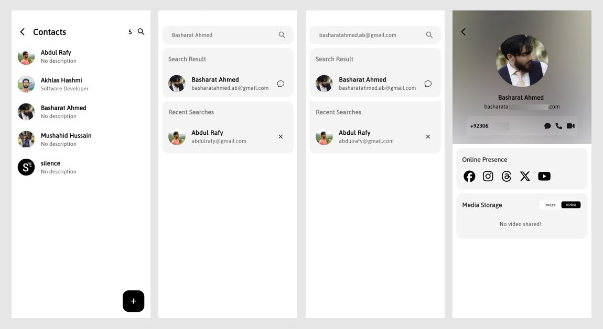
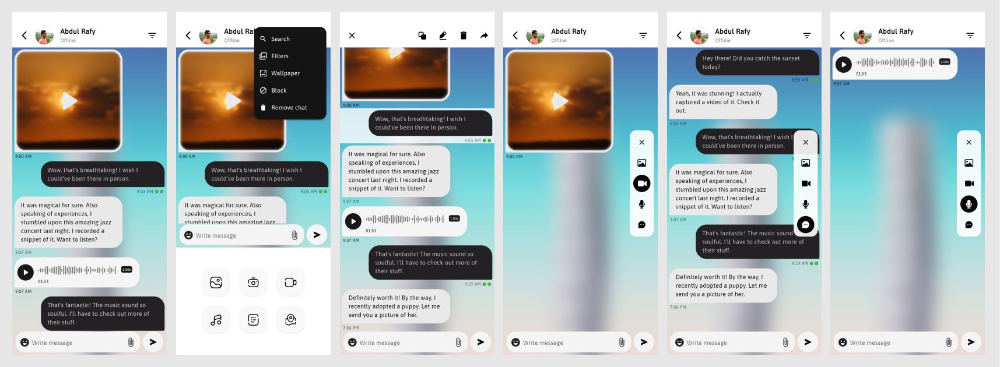
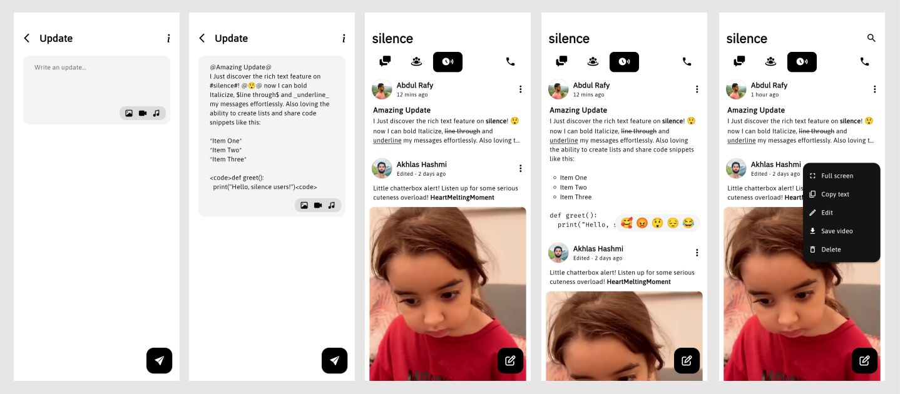
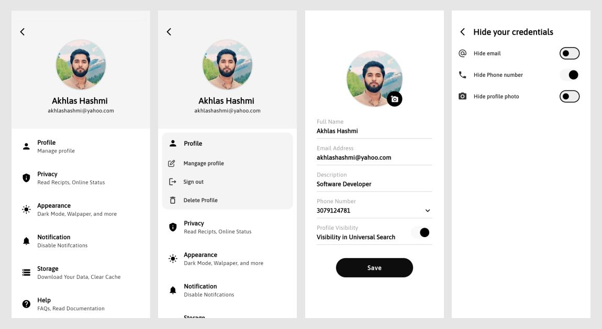

# Silence - A Real Time Chat App Overview

Silence is a real-time chat application developed in Flutter, offering a range of features for seamless communication among users. The app focuses on privacy, security, and user control, providing a platform where users can engage in one-to-one chats, group messaging, share updates via timeline, and create sub-groups known as Circles.

## Broad Features

1. **One-to-One Chat**: Users can engage in private conversations with their contacts.
2. **Group Messaging**: Allows users to create and participate in group chats.
3. **Timeline**: Users can share their thoughts and updates with their contacts.
4. **Circles**: Enables the creation of sub-groups or communities for specialized discussions.

## App Functionalities

### Authentication
- **Login**: Users can securely log in to their accounts to access the app's features.
- **Register**: New users can create accounts to join the Silence community.
- **Password Reset**: Offers the functionality to reset passwords in case users forget it.

  
### Contact Management

 - **Load Contacts**: The app loads contacts that are using Silence, facilitating communication with known contacts.
 - **Universal Search**: Users can search for and initiate chats with people not in their contacts using keywords such as phone number, email, or name.

 

### Messaging Features

- **Messages Managements**: Enables users to edit, forwared, download(video/audio/image), messages.
- **Caching Media/Messages**: Caching is implemented to minimize the network requests and make over all app experience faster.
- **Advanced Filtering**: Enables users to filter messages based on categories such as images, videos, text, or audio.

### Appearance Customization

- **Chat Wallpapers**: Users can customize chat backgrounds by selecting wallpapers.
- **Theme Modes**: Offers light and dark modes for personalized visual preferences.

### Timeline Interaction
- **Post a thought/Update**: Users can share their thoughts to their contacts' only contacts can see what you share.
- **Manage thoughts**: silence provided multiple options to manage thoughts/updates i.e. **Edit**, **Delete**, **Download** media in shared thought.
- **Reactions**: Users can react to other users' timeline posts privately within the chatroom.

## Security Features

- **Data Control**: Users can control the amount of data shared with their contacts, including hiding phone numbers, emails, or profile photos.
- **Visibility Control**: Users can choose whether they want to appear in the universal search bar or remain hidden.
- **End-to-End Encryption**: Planned feature to enhance security and privacy of user communications.

## Progress

 - [x] One-to-One Chats
 - [x] Group Messaging
 - [x] Timeline Updates
 - [x] Caching Mechanism
 - [ ] Implement Circles functionality
 - [ ] End-to-End Encryption

## Screenshots

## Conclusion

Silence is an evolving real-time chat application designed to prioritize **User Experience**, **Privacy**, **Security**, and **User Control**. With its range of features and planned enhancements, Silence aims to provide users with a seamless and secure communication experience.

|Developers | UI/UX Designers | 
|--|--|
| Akhlas Ahmed (Main Lead) |Basharat Ahmed (Main Lead) |
| Basharat Ahmed (Follow up) | Akhlas Ahmed (Follow up) |
